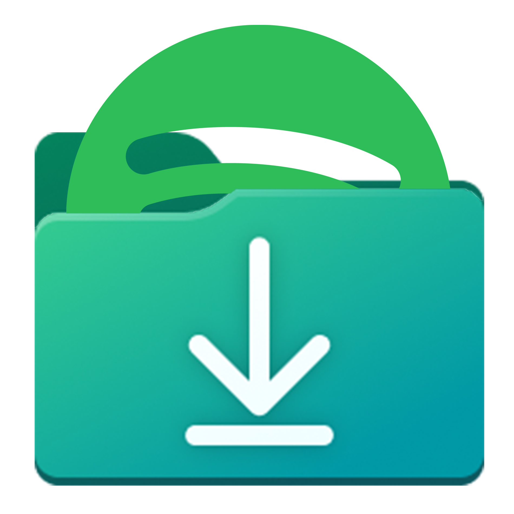

    

    
    

# 💬 SpotifydownWrapper
A wrapper for Spotifydown because their website sucks 

# 📌 Features
- Written in C# (.NET Framework 4.7.2)
- Quick download times
- Downloads the whole playlists
- Can choose the output folder

# 👨‍💻 Contributing
You may proceed with the following steps if you wish to contribute to this project

1. Fork or clone this repository
2. Make your changes
3. Commit & push your changes
4. Submit a pull request here

# ⚖ License
This project is licensed under the GPLv3 license
 
You may refer to the "LICENSE" file for more information
